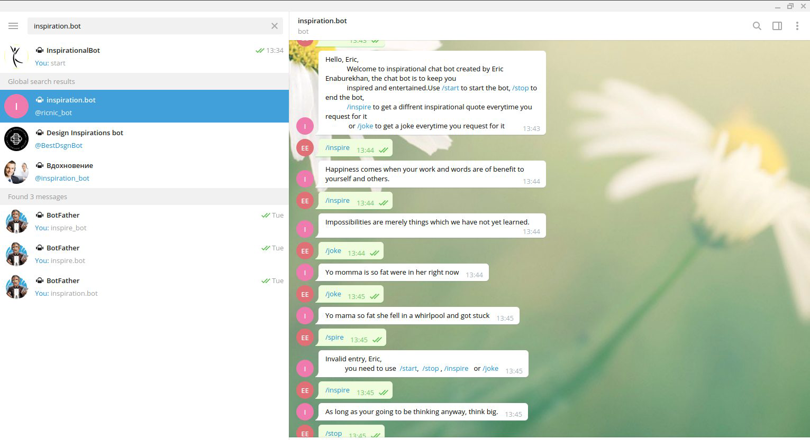

# TElEGRAM_INSPIRATIONAL_BOT
Building a TELEGRAM Inspirational Bot that can be initialized on the command line(windows) / terminal(mac & linux) where it sends inspirational messages and jokes to a specific user on his or her TELEGRAM account

This is my capstone project for the ruby curriculum at microverse which is an online coding school

## Built With

- RUBY 2.7.0
- VS Code
- TELEGRAM Bot API
- Type fit Quotes API
- Yo mamma Jokes API

## Getting Started

This project involves building a TELEGRAM bot that listens to command from any TELEGRAM account user and then provide response based on the command entered by the user. 

### Prerequisites

To get this project up and running, you must have RUBY installed on your machine.
To install RUBY, you can use this link: https://www.ruby-lang.org/en/documentation/installation/

### Installation

**To get this project set up on your local machine, follow these simple steps:**

- Clone the github repository https://github.com/enaburekhan/Telegram_Inspirational_Bot.git on your local machine
- Cd into the clone folder
- Initialize the ruby gem files and run bundle install to install the dependencies
- Create the bot.rb, inspire.rb and joke.rb file inside the lib directory.
- create the executional file called main.rb inside the bin directory
- run ruby bin/main.rb
- Navigate to your telegram account and search **inspiration.bot** or;
- using this link: http://t.me/ricnic_bot, you can navigate to the **inspiration.bot**
- Press the /start to follow the steps given
- Press control C on terminal to end the program

**How to Test the Methods In the Classes**

- Install Rspec gem in your system. To do this:
- Open Command Prompt or Terminal and run:
   - Rspec --init in the project directory
   - Create the telegram_bot_spec.rb file
   - Run rspec

## Author

👤 **Eric Enaburekhan**

- Github: [@enaburekhan](https://github.com/enaburekhan)
- Twitter: [@enaburekhaneric](https://twitter.com/enaburekhaneric)
- Linkedin: [@ericenaburekhan](https://www.linkedin.com/in/eric-enaburekhan-801a28100/)

## Show your support

Contributions, issues and feature requests are welcome!.

## Acknowledgments

- My thanks goes to Microverse and all our peers and colleagues there.

